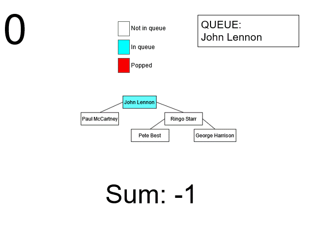

# Coding Challenge Explanation

Hi Mindex Team! Thank you for this opportunity. I've heard great things about Mindex and the work that is done here looks very
fun and interesting. I've decided to add these explanations so that you can see my thought process and how
I approach solutions for these problems.

**NOTE:**
I've added a few tests in `/postmantests/`. You can import these files in Postman as collections. They do depend on the
data being fresh and untouched to run however. So if you want to rerun the tests, they may not work properly unless you
restart the application. 
- Task 1's test shows how the numberOfReports correctly returns the correct number for `John Lennon`,
then after adding a new `Employee` and adding them to `John Lennon's` direct reports, it will increase by 1 to reflect the
newly updated reports.
- Task 2's test shows how the new `Compensation` object functions. It will add a new `Compensation` object, ensure
the `Employee` object persists, and ensure that the `salary`/`effectiveDate` fields are added properly. It will then retrieve
this compensation with a GET request, and ensure that the `Employee's` data along with their `salary` and `effectiveDate` show
up.
---

### Task 1
For this task, I knew that I could use BFS or DFS since these `directReports` can make a tree of `Employees`.
I went with BFS because I find it easier to implement, and since the entire tree must be traversed, the performance should
be similar between both algorithms.

Using a `LinkedList` as a queue, it will add the head `Employee` (the `Employee` of the provided `employeeId`). Then, the queue
will do the following until it is empty at the end of an iteration:
- Pop the oldest `Employee` in the queue and add 1 to the sum
- Get the list of `Employees` that report to the popped `Employee`
- Add those `Employees` to the queue



I decided to put the endpoint for this in the `EmployeeController` instead of creating a separate controller since its data is closely
related to `Employee`. However, a case could be made to separate this functionality into a different controller and service, especially
if this functionality is expanded upon.

The time complexity of `numberOfReports()` is `O(n)`, where `n` is the number of `Employees` in the tree of the starting `Employee`.

The space complexity of `numberOfReports()` is `O(n)`, where `n` is the number of `Employees` in the tree of the starting `Employee`.
### Task 2
For the new object `Compensation`, since it's an entirely new read and write (GET and POST), I decided to make a new controller.
Since the values need to come from the persistence layer, I created a new `CompensationRepository`.

Because `Compensation's` `Employee` object only needs the ID, the other fields in `Employee` may be null. Because of this, in the service layer, 
I use the `EmployeeRepository` to retrieve the `Employee` with the proper fields, and set this object as the returned `Compensation's` `Employee`.

That way, instead of the return object looking like this:

```
{
    "employee": {
        "employeeId": "03aa1462-ffa9-4978-901b-7c001562cf6f",
        "firstName": null,
        "lastName": null
        "position": null
        "department": null
        "directReports": null,
    },
    "salary": 34232.11,
    "effectiveDate": "2023-04-03"
}

```
It looks like this:
```
{
    "employee": {
        "employeeId": "03aa1462-ffa9-4978-901b-7c001562cf6f",
        "firstName": "Ringo",
        "lastName": "Starr",
        "position": "Developer V",
        "department": "Engineering",
        "directReports": [
            {
                "employeeId": "62c1084e-6e34-4630-93fd-9153afb65309",
                "firstName": null,
                "lastName": null,
                "position": null,
                "department": null,
                "directReports": null
            },
            {
                "employeeId": "c0c2293d-16bd-4603-8e08-638a9d18b22c",
                "firstName": null,
                "lastName": null,
                "position": null,
                "department": null,
                "directReports": null
            }
        ]
    },
    "salary": 34232.11,
    "effectiveDate": "2023-04-03"
}
```

The same thing was done for the read method.

**NOTE:** I used `@DBRef` on `Compensation's` `Employee` field. This is to automatically use that object's ID field when querying.
This is especially useful for using `MongoRepository's` interface. Instead of having to do `findByEmployeeEmployeeId()`, we can make it
look a lot cleaner and more intuitive with `findByEmployee()`. However, `@DBRef` requires that a field be labeled as the ID, or else
it won't be able to query. This is easily done by adding `@Id` to the desired parameter, which is done on `Employee's` `employeeId`.

---

Hopefully these explanations were helpful with following along with my implementations and solutions to these tasks.

I'm very excited to receive feedback on this. Thanks again for taking the time to review this!
